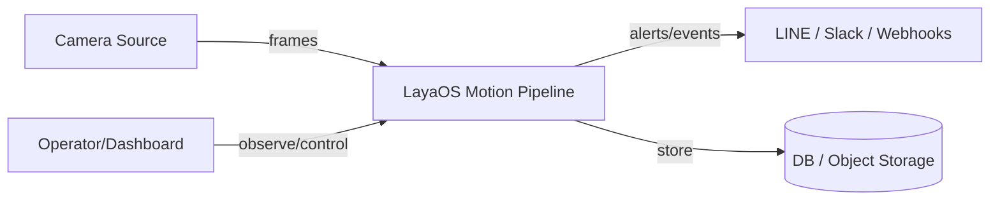
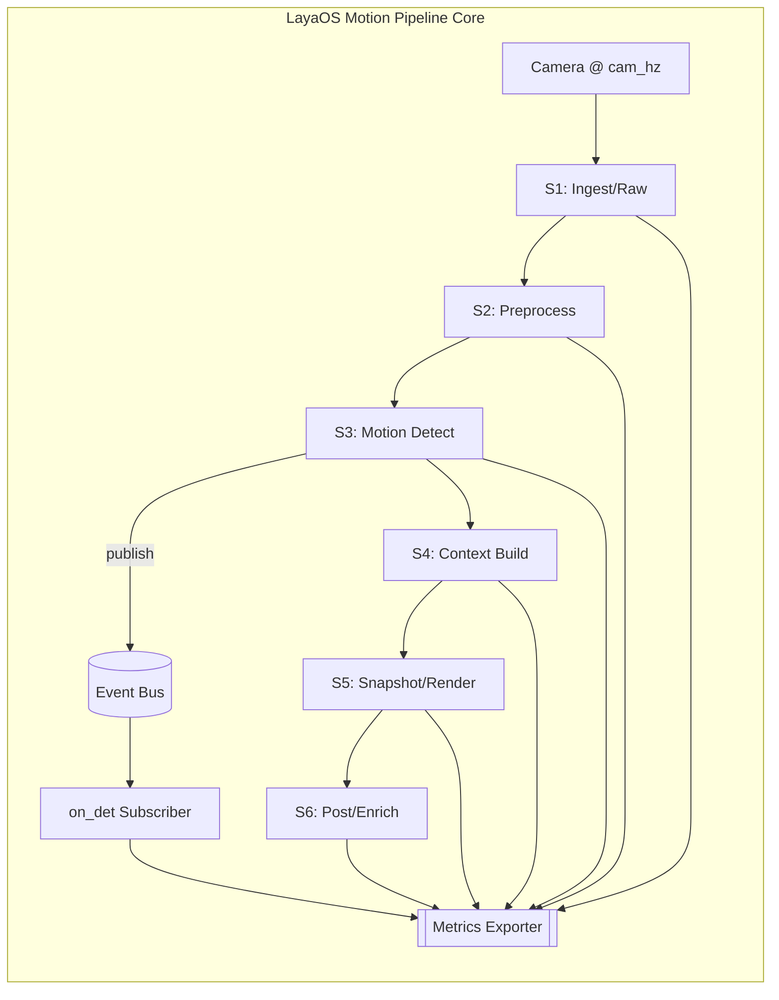
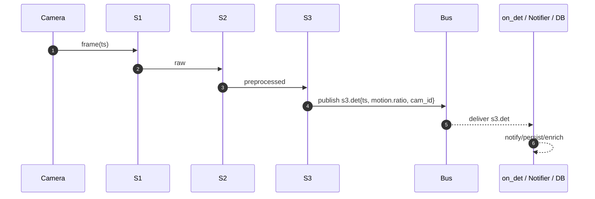
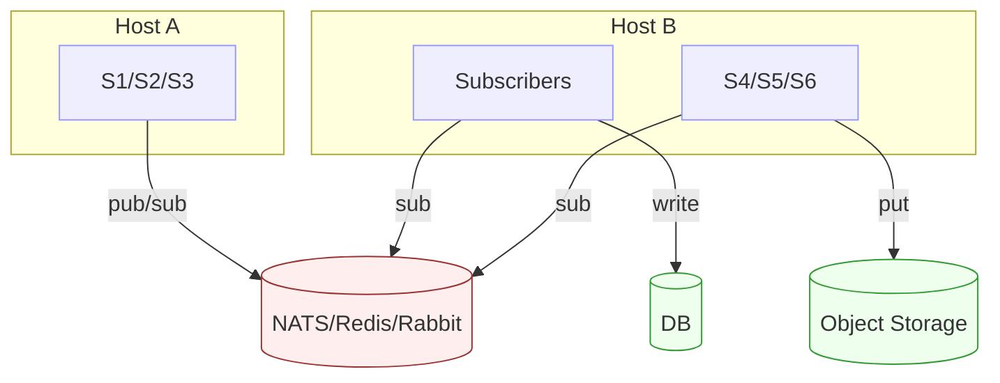

# Architecture Overview – LayaOS Motion Pipeline

> บทสรุปภาพใหญ่ของสถาปัตยกรรม: วัตถุประสงค์ องค์ประกอบหลัก การไหลของข้อมูล
> และคุณลักษณะเชิงคุณภาพที่ระบบนี้ตั้งใจให้มี

---

## 1) Purpose & Scope
- สร้าง **Core Motion Pipeline** ที่เป็น event-driven, มีจังหวะ (rhythmic), ขยายต่อได้ง่าย
- ใช้สำหรับงาน motion detection และต่อยอดไปยังการแจ้งเตือน/บันทึก/วิเคราะห์ขั้นสูง
- เอกสารนี้ครอบคลุมมุมมองระดับระบบ (System view) ไม่ลงรายละเอียดโค้ด

---

## 2) Context (C4: System Context)
- **Actors**
  - *Camera Source* (กล้องจริง/จำลอง)
  - *Operator / Dashboard* (ผู้ดูแลระบบ/ผู้ใช้)
  - *External Services* (LINE/Slack, Object Storage, DB)
- **System**
  - LayaOS Motion Pipeline Core (S1–S6 + Bus + Metrics)



---

## 3) Logical Architecture (Component View)
องค์ประกอบหลักของ **Core**



**Responsibilities**
- **S1–S3**: ingest → preprocess → detect (ผลิต `s3.det`)  
- **Bus**: backbone สำหรับ pub/sub ภายใน (สลับเป็น NATS/Redis ได้)  
- **S4–S6**: enrich context, render media, เตรียมข้อมูลสำหรับแจ้งเตือน/บันทึก  
- **Subscribers**: ผู้บริโภค event (เช่น `on_det`, `notifier.*`, `persistence.*`)  
- **Metrics**: latency per-state, e2e, queue depth, throughput ฯลฯ

---

## 4) Runtime View (Sequence per Tick)
1. กล้องสร้างเฟรมตาม **cam_hz**  
2. S1→S2→S3 ประมวลผล → สร้าง event `s3.det { ts, motion.ratio, cam_id, ... }`  
3. Publish เข้า **Bus** → Subscribers รับไปทำงาน (แจ้งเตือน/บันทึก/ต่อ AI อื่น)  
4. Metrics บันทึก **e2e latency**, per-state latency, คิว, throughput



---

## 5) Events & Contracts (Summary)
- **Topic:** `s3.det`  
- **Schema (ย่อ):**
  ```json
  {
    "schema_version": 1,
    "cam_id": "cam0",
    "ts_ns": 1723871293000000000,
    "motion": { "ratio": 0.013 },
    "frame_ref": "local://frames/xyz" 
  }
  ```
- **หลักการ:** versioned schema, adapters สำหรับ producers ที่ต่างกัน, หลีกเลี่ยง payload หนักใน bus (ใช้ reference ชี้ไฟล์)

---

## 6) Deployment View
- **Single-Process (Dev/Demo)**: Bus in-process, tasks asyncio  
- **Split-Process / Container (Prod)**: แยก S1–S3, S4–S6, Subscribers และเปลี่ยน bus เป็น **NATS/Redis/RabbitMQ**  
- **Storage**: DB (SQLite/Postgres) + Object Storage สำหรับ snapshot/clip



---

## 7) Quality Attributes
- **Observability**: metrics ครอบคลุม e2e/per-state/queue/throughput + dashboards/alerts  
- **Scalability**: เพิ่ม subscribers หรือแยก process ได้โดยไม่แตะ core logic  
- **Resilience**: graceful shutdown, backpressure, retry/backoff, watchdog  
- **Extensibility**: เสียบ rules/AI/outputs ใหม่ผ่าน event interface

---

## 8) Risks & Mitigations
- **Schema drift** → ใช้ schema version + adapter + test contract  
- **Backpressure/Latency** → bounded queue + rate-limit + monitor queue depth  
- **I/O หนัก** → เก็บเฉพาะช่วง event + reference file แทน payload  
- **Privacy** → masking/retention/RBAC (ถ้ามี dashboard/API)

---

## 9) Roadmap Hooks
- แจ้งเตือน (LINE/Slack) พร้อม dedup/rate-limit  
- Persistence + Search  
- Web Dashboard + Overlay  
- Split-process + NATS/Redis + HA/Tracing

---

## 10) Glossary (ย่อ)
- **cam_hz**: ความถี่ของเฟรมกล้อง (Hz) = จังหวะฐานของระบบ  
- **Bus**: ระบบ pub/sub สำหรับส่งต่อ event  
- **Subscriber**: โมดูลที่ subscribe topic แล้วทำงานต่อยอด  
- **e2e latency**: เวลาจากสร้าง event ถึงถูกบริโภคโดย subscriber  

